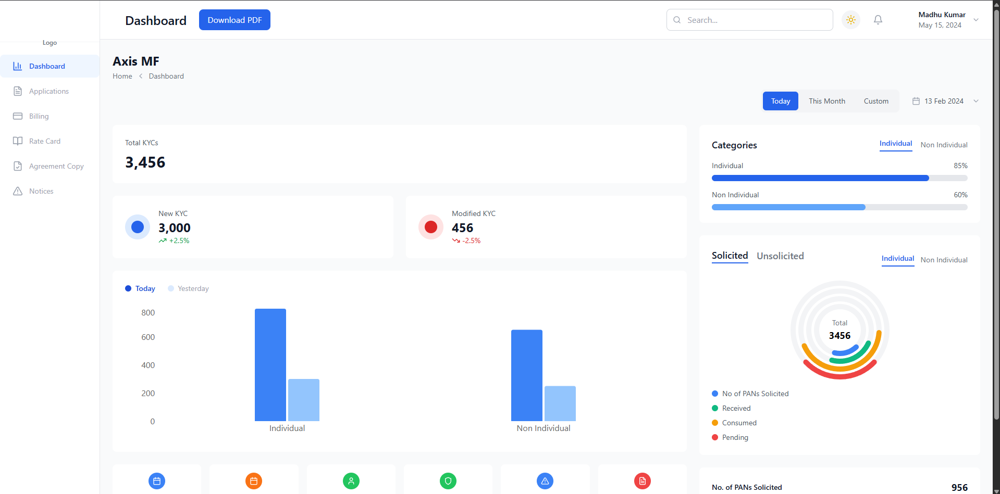

# My Next.js App

A modern **Next.js application** scaffolded for building robust, full-stack web projects.

## Features

- Server-side rendering (SSR) and static site generation (SSG)
- Built with React and Node.js
- File-based routing
- Support for API routes within the project
- Automatic code splitting and optimized performance
- SEO-friendly by design

## Project Structure

Typical Next.js projects maintain a clean, modular file structure for scalability:

```
/my-nextjs-app
  /app or /pages        # Main routing folders (app: newer Next.js, pages: classic)
  /components           # Shared UI components
  /public               # Static assets (images, fonts, favicon)
  /styles               # CSS modules or global styles
  /api                  # API endpoints (if using pages/api)
  next.config.js        # Next.js configuration
  package.json          # Project dependencies/scripts
  README.md             # Project overview and instructions
```
> Structure may vary depending on your Next.js version.

## Getting Started

### Prerequisites

- Node.js (version 14.x or higher recommended)
- npm or yarn package manager

### Installation

1. **Clone the repository:**
   ```
   git clone https://github.com/Krishmodi33/my-nextjs-app.git
   ```
2. **Navigate to the project directory:**
   ```
   cd my-nextjs-app
   ```
3. **Install dependencies:**
   ```
   npm install
   ```
   or
   ```
   yarn install
   ```

### Running the Development Server

```bash
npm run dev
```
or
```bash
yarn dev
```
Open [http://localhost:5173](http://localhost:5173) to view in your browser.

### Building and Starting in Production

```bash
npm run build
npm start
```
or
```bash
yarn build
yarn start
```
### Screenshot of the Dashboard
